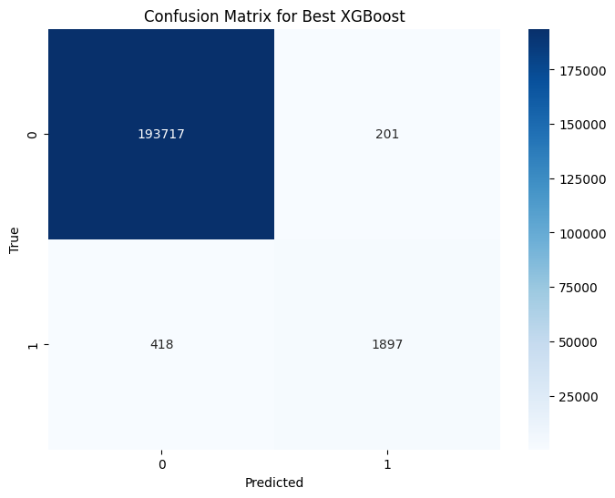
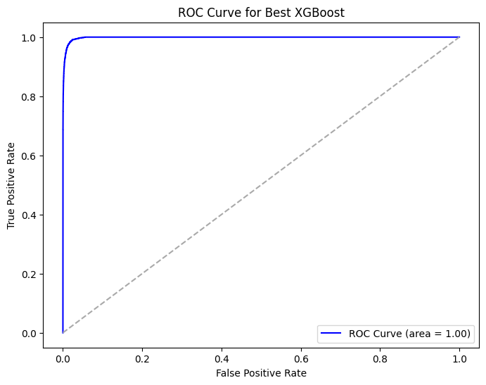
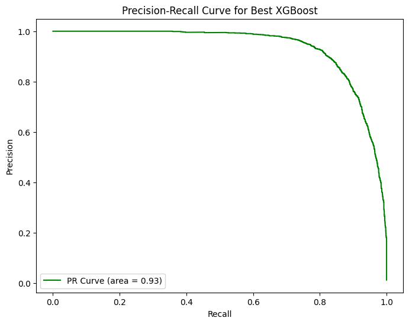

# 💳 Fraud Detection in Banking Transactions

This project aims to detect fraudulent transactions in banking data using supervised machine learning models, with a focus on handling class imbalance. The dataset is rich and realistic, containing customer, merchant, and transaction-level details. Our goal is to build a robust classification system that minimizes false negatives (Type II errors), ensuring fraudulent activity is detected as accurately as possible.

---

## 📂 Dataset Overview

- **Source**: Kaggle
- **Rows**: 1,000,000+ transaction records
- **Features**:
  - Customer ID, Gender, Age Category
  - Merchant & Transaction Category
  - Amount, Timestamp, Fraud label
- **Target Variable**: `fraud` (1 = Fraudulent, 0 = Legitimate)

**Key Observation**:  
Only **~1.21%** of transactions are fraudulent, highlighting a severe **class imbalance** — a common challenge in real-world fraud detection problems.

---

## 🧪 Project Workflow

### 🔍 1. Exploratory Data Analysis (EDA)
- Identified feature trends and correlations.
- Found that fraudulent transactions, though fewer in number, involved higher monetary values.
- Category-wise fraud: `sportsandtoys`, `health`, and `beauty` had higher fraud rates.
- Age groups 2 and 3 were more involved in fraud; females slightly more than males.

### ⚖️ 2. Handling Class Imbalance
- Applied **SMOTE (Synthetic Minority Over-sampling Technique)** to balance the training data.
- SMOTE was applied **after splitting** to avoid data leakage and ensure realistic evaluation.

### 🧪 3. PCA for Dimensionality Reduction
- Implemented **Principal Component Analysis (PCA)** to assess whether dimensionality could be reduced.
- PCA was evaluated based on **explained variance ratio**.
- Final decision: Retained original features since PCA components already captured sufficient variance, and did not significantly improve model performance.

### ⚙️ 4. Feature Engineering & Preprocessing
- Label encoding for categorical variables.
- Scaling of numerical features.
- Combined engineered and original features for model input.

### 🤖 5. Model Training
- Trained the following models:
  - Logistic Regression
  - K-Nearest Neighbors (KNN)
  - Random Forest
  - XGBoost
  - Voting-based Ensemble Classifier

### 🔧 6. Hyperparameter Optimization
- Performed **RandomizedSearchCV** and **GridSearchCV** on key models.
- Optimization based on **recall** to emphasize identifying fraud.

### 📈 7. Model Evaluation
- Evaluated all models using:
  - Accuracy, Precision, Recall, F1-Score
  - Confusion Matrix
  - ROC-AUC and **Precision-Recall AUC (PR-AUC)**

---

## 🧠 Best Performing Model: XGBoost

XGBoost, after tuning, emerged as the top performer:

- ✅ High ROC-AUC
- ✅ Balanced Precision & Recall
- ✅ Lowest Type II error (missed frauds)

---

## 📊 Evaluation Visuals


### 🔹 Confusion Matrix – XGBoost


### 🔹 ROC Curve – XGBoost


### 🔹 Precision Recall Curve – XGBoost


---

## 🛠 Technologies Used

- Python, Jupyter Notebook
- `pandas`, `numpy`, `seaborn`, `matplotlib`
- `scikit-learn` (models, metrics, PCA)
- `imblearn` for SMOTE
- `xgboost`
- `PCA` for dimensionality reduction

---

## 🚀 How to Run

1. Clone this repository:
```bash
git clone https://github.com/yashling/Banking-Fraud-Detection.git
cd Banking-Fraud-Detection
jupyter notebook fraud_detection_classifiers_pca_smote_ensemble.ipynb
